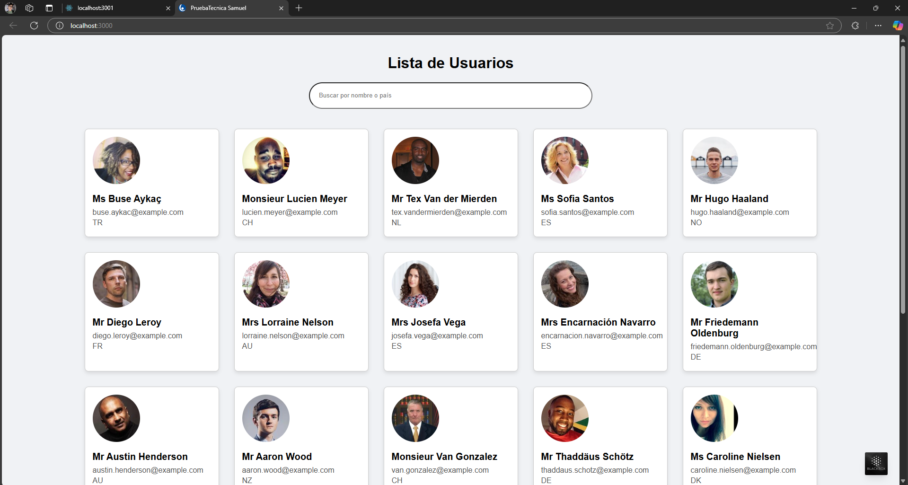
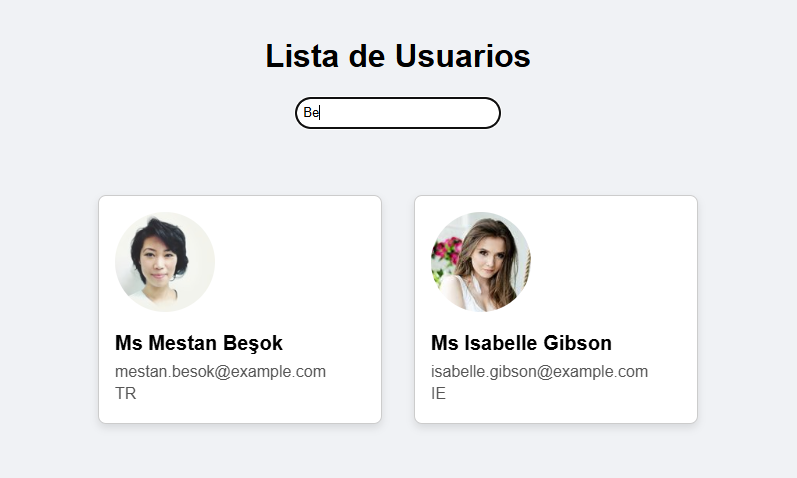
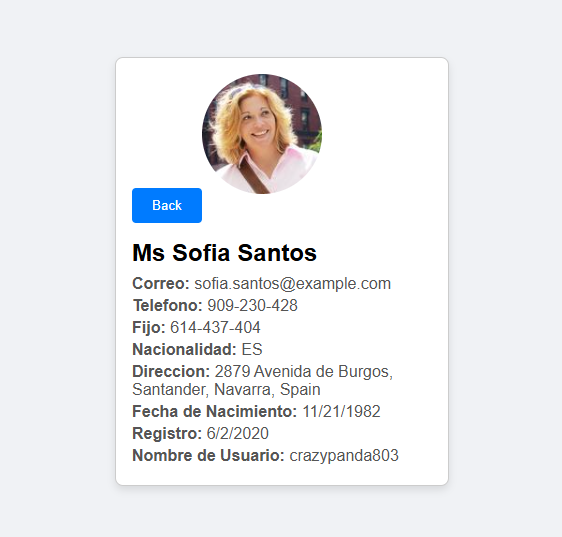

# PRUEBA TÉCNICA - DESARROLLADOR WEB

Plazo máximo de entrega: lunes 3 de marzo, 5:00 a.m. 

el objetivo del proyecto es evaluar los conocimientos en React (frontend), Node.js (backend), Oracle (base de  datos) y el manejo de versiones con GitLab, así como la capacidad lógica y de resolución  de problemas del candidato.


## Dependencias del Proyecto

#### Frontend(React)

- **React**: Biblioteca para construir interfaces de usuario.

- **Axios**: Cliente HTTP para realizar solicitudes a la API.

#### Backend (Node.js)

- **Express**: Framework para aplicaciones web en Node.js.

- **Axios**: Cliente HTTP para realizar solicitudes a la API externa.

- **Cors**: Middleware para habilitar CORS (Cross-Origin Resource Sharing).


## Ejecución del Programa

1. **Instalar** dependencias para el front

```bash
cd Prueba-Tecnica
npm install axios
```

2. **Instalar** dependencias para el back

```bash
cd randomuser-proxy
npm install express axios cors
```

3. **Iniciar** el servidor backend

```bash
node server.js
```

4. **Iniciar** la aplicación frontend

```bash
cd my-react-app
npm start
```

5. **Acceder** a la aplicación

```
Abre tu navegador y ve a http://localhost:3000
```


## Explicacion del Programa

#### Backend

1. Primeramente se inicia el servidor usando Express para manejar las solicitudes

2. luego se comunica con la aplicacion frontend mediante CORS
3. se define un endpoint /api/usuarios para que pueda realizar la solicitud de los datos de los 25 usuarios
4. se hace una solicitud GET a la API para obtener los datos
5. evalua que no hay fallos al comunicarse con la API y al obtener los datos, en caso de que existan, se comunica al usuario en consola con un mensaje de error

#### Frontend

1. Maneja diferentes componentes como la barra de busqueda, la lista de usuarios, las cartas con la informacion de los usuarios y los detalles que se van a mostrar cuando se seleccione un usuario
2. se obtiene la lista de usuarios de el backend mediante un GET
3. al seleccionar un usuario, este se guarda y se solicitan todos los detalles para mostrarlos inmediatamente al usuario, mostrando un nuevo componente y permite ocultarlo nuevamente con el boton de back







## Bases de datos


1. #### Creación de tablas

```sql
CREATE TABLE USUARIOS (
    ID INT AUTO_INCREMENT PRIMARY KEY,
    NOMBRE VARCHAR(100) NOT NULL,
    CORREO VARCHAR(50) NOT NULL UNIQUE,
    PAIS VARCHAR(50),
    FOTO VARCHAR(255)
);
```

```sql
CREATE TABLE DIRECCIONES (
    ID INT AUTO_INCREMENT PRIMARY KEY,
    USUARIO_ID INT,
    CALLE VARCHAR(100),
    CIUDAD VARCHAR(50),
    ESTADO VARCHAR(50),
    CODIGO_POSTAL VARCHAR(20),
    FOREIGN KEY (USUARIO_ID) REFERENCES USUARIOS(ID)
);
```


2. #### Relacionamiento y Consultas

- Insertar 5 registros en la tabla USUARIOS y 5 registros en la tabla DIRECCIONES,  asegurando que cada dirección esté relacionada con un usuario. 

```sql
INSERT INTO USUARIOS (NOMBRE, CORREO, PAIS, FOTO) VALUES
('Juan Pérez', 'jjperez983@gmail.com', 'Colombia', 'https://th.bing.com/th/id/OIP.NqlzjzgzfHI046FjmPZkogHaEK?w=280&h=180&c=7&r=0&o=5&pid=1.7'),
('María García', 'maria.garcia@hotmail.com', 'México', 'https://d-art.ppstatic.pl/kadry/k/r/1/52/e0/66546aef0ff6c_o_large.jpg'),
('Carlos López', 'carlop@ejemplo.com', 'España', 'https://th.bing.com/th/id/OIP.1XmctktVAucZaVUCyVV6hAHaE8?rs=1&pid=ImgDetMain'),
('Ana Martínez', 'amartinez@yahoo.com', 'Argentina', 'https://th.bing.com/th/id/OIP.Q8r6v--dGhDJ_SS_8ZLZRQHaFj?rs=1&pid=ImgDetMain'),
('Luisa Fernández', 'luisa2615@icloud.com', 'Chile', 'https://th.bing.com/th/id/OIP.6iU-Wz-BqHQXV5IW4g9QnAHaEK?rs=1&pid=ImgDetMain');
```

```sql
INSERT INTO DIRECCIONES (USUARIO_ID, CALLE, CIUDAD, ESTADO, CODIGO_POSTAL) VALUES
(1, 'Calle 123', 'Bogotá', 'Cundinamarca', '110111'),
(2, 'Avenida Revolución', 'Ciudad de México', 'CDMX', '01000'),
(3, 'Calle Gran Vía', 'Madrid', 'Madrid', '28013'),
(4, 'Avenida de Mayo', 'Buenos Aires', 'Buenos Aires', '1084'),
(5, 'Calle Providencia', 'Santiago', 'Santiago', '7500000');
```

- Escribir una consulta SQL que devuelva el nombre del usuario, su correo y su  dirección completa (calle, ciudad, estado y código postal).  

```sql
SELECT 
    USUARIOS.NOMBRE, 
    USUARIOS.CORREO, 
    DIRECCIONES.CALLE, 
    DIRECCIONES.CIUDAD, 
    DIRECCIONES.ESTADO, 
    DIRECCIONES.CODIGO_POSTAL
FROM 
    USUARIOS
INNER JOIN 
    DIRECCIONES ON USUARIOS.ID = DIRECCIONES.USUARIO_ID;
```

- Crear una vista llamada VW_USUARIOS_CON_DIRECCIONES que muestre el nombre  del usuario, su correo y su dirección completa. 

```sql
CREATE VIEW VW_USUARIOS_CON_DIRECCIONES AS
SELECT 
    USUARIOS.NOMBRE, 
    USUARIOS.CORREO, 
    DIRECCIONES.CALLE, 
    DIRECCIONES.CIUDAD, 
    DIRECCIONES.ESTADO, 
    DIRECCIONES.CODIGO_POSTAL
FROM 
    USUARIOS
INNER JOIN 
    DIRECCIONES ON USUARIOS.ID = DIRECCIONES.USUARIO_ID;
```

- Crear un procedimiento almacenado que reciba como parámetro el ID de un  usuario y devuelva su nombre, correo y país.  

```sql
DELIMITER //
CREATE PROCEDURE ObtenerUsuario(
    IN usuario_id INT
)
BEGIN
    SELECT NOMBRE, CORREO, PAIS
    FROM USUARIOS
    WHERE ID = usuario_id;
END //
DELIMITER ;

CALL ObtenerUsuario(1);
```


## Parte 3: Manejo de Versiones (GitLab) - Entregables 


- Crear un repositorio público en GitLab con el código de la aplicación web  (frontend y backend) y los scripts de la base de datos.  
  - Realizar commits significativos que muestren el progreso del desarrollo.  
  - Incluir un README.md en el repositorio con: 
    - Instrucciones para ejecutar el proyecto (frontend, backend). Instalación  de dependencias y más.  
    - Explicación breve de la estructura del proyecto.  
    - Capturas de pantalla de la aplicación funcionando. (Extra) 
